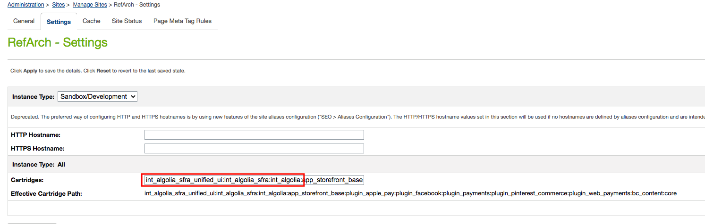

# int_algolia_sfra_unified_ui

## Setup Instructions

### A. Download an upload the cartridge to your Sandbox

1. Clone this repository including git submodules
    ```sh
    $ git clone --recurse-submodules https://github.com/algolia/int_algolia_sfra_unified_ui 
    ```
2. install dependencies
    ```sh
    $ cd int_algolia_sfra_unified_ui 
    $ npm install && npm install --prefix unified-instantsearch-ecommerce
    ```

3. compile & export Unified UI
    ```sh
    $ npm run --prefix unified-instantsearch-ecommerce export
    ```
   
4. upload the cartridge
    ```sh
    $ npm run uploadCartridge
    ```
   
### B. Assign the cartridge to your site

1. In your sandbox Business Manager, go to **Administration → Sites → Manage Sites**.
2. Select your site
3. Under the **Settings** tab, in the **Catridges** field, add `int_algolia_sfra_unified_ui` before `int_algolia_sfra:int_algolia`.

    Your result path should contain the following: `int_algolia_sfra_unified_ui:int_algolia_sfra:int_algolia`
    
    
    
🎉  Now the Unified UI catridge is live on your site.
                                                                                                                                       
                                                                                                                                 
